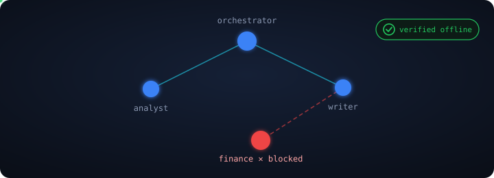
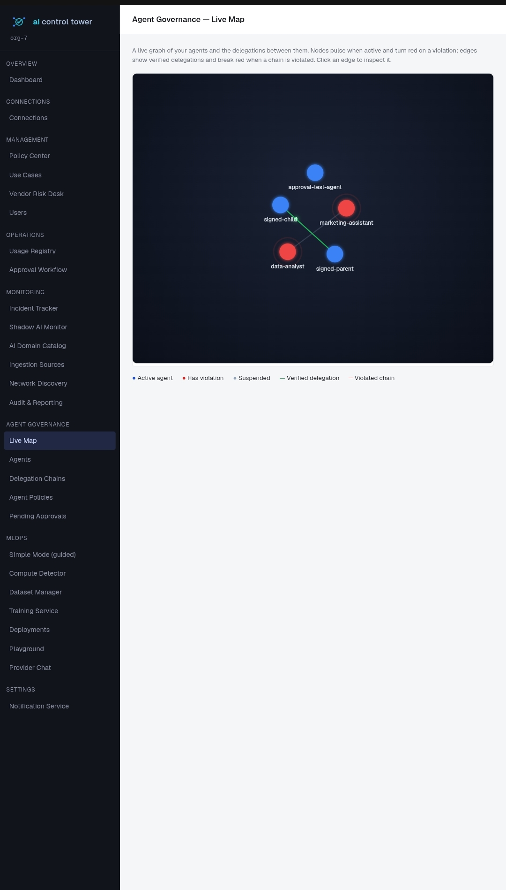
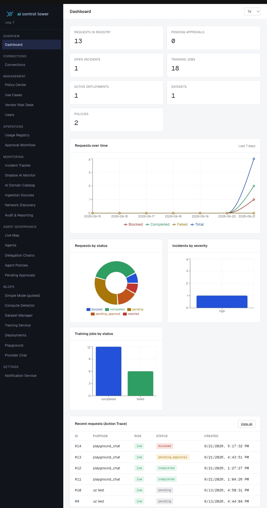
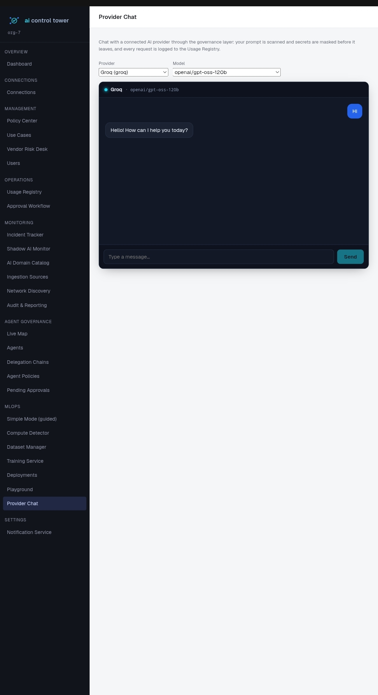
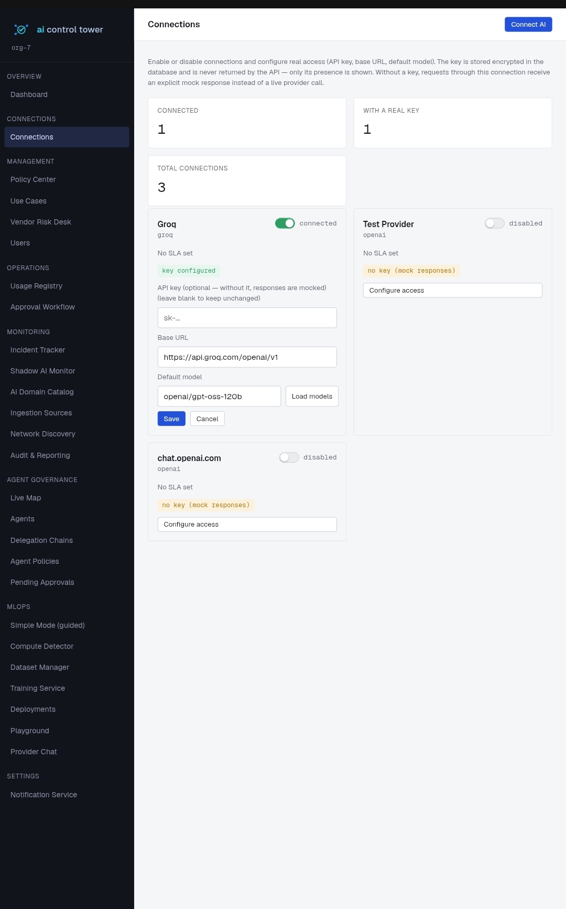

<p align="center">
  
</p>

<p align="center">
  
</p>

<p align="center">
  <b>Provenance for every AI action.</b><br>
  <sub>See and govern every AI in your company — with provable accountability.</sub><br>
  From an employee pasting into ChatGPT to autonomous agents acting on their own —<br>
  watch it, control it, and <b>prove</b> every decision was authorized. Self-hosted, no external SaaS.
</p>

<p align="center">
  <a href="https://opensource.org/licenses/Apache-2.0"></a>
  <a href="https://github.com/kironovlaziz-del/provenza/actions/workflows/ci.yml"></a>
  
  <a href="CODE_OF_CONDUCT.md"></a>
  <a href="CONTRIBUTING.md"></a>
</p>

<p align="center">
  <a href="#-quick-start"><b>🚀 Quick Start</b></a> &nbsp;·&nbsp;
  <a href="#-what-makes-it-different"><b>✨ Why it's different</b></a> &nbsp;·&nbsp;
  <a href="USER_GUIDE.md"><b>📖 Docs</b></a> &nbsp;·&nbsp;
  <a href="#-what-it-does"><b>🧩 Features</b></a>
</p>

---

> **AI entered your company through every door at once** — shadow AI on laptops,
> autonomous agents delegating to each other, and no way to *prove* who authorized
> what. Most governance tools watch one door. **Provenza covers them all,
> under one set of rules.**

## ✨ What makes it different

### 🔐 Verifiable Agent Governance — nobody else does this

When one AI agent delegates a task to another, the handoff is **signed with Ed25519**.
Open the live delegation map, click any edge, and **verify the signature right in your
own browser** — without trusting the server. The server holds only the public key; it
can verify, never forge.

This is the *verifiable accountability* the EU AI Act asks for — made **clickable**.
An auditor confirms who authorized what, and the math checks out on their machine.

<p align="center">
  
</p>

> 🟦 active agent &nbsp; 🟥 policy violation &nbsp; — verified delegation &nbsp; ┈ blocked chain &nbsp; ✓ verified in your browser

---

## 📸 Screenshots

<table>
  <tr>
    <td width="50%">
      <b>Live delegation map</b><br>
      <sub>Agents, delegations, violations — signatures verified in-browser</sub><br>
      
    </td>
    <td width="50%">
      <b>Dashboard</b><br>
      <sub>Requests, incidents, training jobs, action trace at a glance</sub><br>
      
    </td>
  </tr>
  <tr>
    <td width="50%">
      <b>Provider Chat</b><br>
      <sub>Chat any LLM through the governance layer — secrets masked, logged</sub><br>
      
    </td>
    <td width="50%">
      <b>Connections</b><br>
      <sub>Manage AI providers — keys encrypted, mock-mode without a key</sub><br>
      
    </td>
  </tr>
</table>

## 🧩 Four layers of control, one tower

|  | Layer | For | What it does |
|--|-------|-----|--------------|
| 🛡️ | **Policy & Prompt Firewall** | everyone | Secrets (cards, keys, IDs) masked before any prompt leaves. Every call logged. Rules built visually — no JSON required. |
| 👁️ | **Shadow AI Monitor** | unsanctioned AI | Endpoint agent finds local models; browser extension warns before a secret is pasted; passive network discovery — nothing auto-connects. |
| 🤖 | **Agent Governance** | autonomous agents | Registry with scoped tools & delegation limits; an agent can never grant more than it holds; kill-switch; the live verifiable graph above. |
| 🧠 | **Build your own AI** | MLOps, simplified | Guided wizard, knowledge bases (RAG), train & deploy — for non-technical users. |

## 🖥️ Governed access to any LLM

Chat with any connected provider (OpenAI, Groq, Anthropic, …) **through the governance
layer**: your prompt is scanned and secrets are masked *before* it leaves, blocked terms
are rejected, and every request is logged to the Usage Registry. Not just monitoring —
real policy applied to live traffic.

## What It Does

### Governance & oversight
- **Policy Center** — author policies, version their JSON rules,
  approve versions, and bind them to use cases.
- **Usage Registry** — every AI call is registered with a purpose,
  risk level, and the full request → response trace.
- **Approval Workflow** — requests that require sign-off are routed
  to designated approvers; decisions are logged.
- **Prompt Firewall** — automatic masking of PII (email, credit card,
  SSN, phone, API keys) and blocking of terms listed in the active
  policy version. The provider never sees raw input.
- **Connections (Vendor Risk Desk)** — manage AI provider credentials
  (OpenAI, Anthropic, Azure OpenAI, or any custom HTTP endpoint) with
  SLA and risk scoring. Keys are encrypted at rest with Fernet.
- **Incident Tracker** — register incidents, track root cause,
  resolve with audit trail.
- **Audit & Reporting** — every mutation in the platform is written
  to `ai_audit_logs` and queryable.
- **Notification Service** — route events (`incident_created`,
  `approval_pending`, `training_completed`, `shadow_ai_reported`,
  `shadow_ai_blocked_domain`, etc.) to email or webhook channels.

### Shadow AI Monitor
- **Telemetry ingestion** — a batched, asynchronous pipeline
  (`POST /shadow-ai/ingest`) that receives events from external
  collectors authenticated by a machine key (`X-Ingestion-Key`), not a
  user session. Every event is logged raw for later behavioral
  analysis; domain visits are classified against the org's catalog.
- **Endpoint Agent** — a native Go binary that detects locally-running
  AI tools (processes like `ollama`/`vllm`, listening ports, and model
  weight files on disk) and reports them.
- **Network Discovery** — the same agent passively discovers network
  services (DNS, gateway, Active Directory via DNS SRV, plus mDNS/LLMNR;
  and ARP scan / passive DHCP when granted `CAP_NET_RAW`). Discovery is
  read-only — nothing is connected until an admin explicitly provides
  credentials (no anonymous auto-attach).
- **Browser Extension** — a Manifest V3 Chrome extension that flags
  visits to known AI services and warns the user before they paste or
  type secrets (API keys, credit cards, private keys) into an AI tool.
- **AI Domain Catalog** — per-org allow/block/unknown classification of
  AI domains that drives what telemetry raises as a sighting or an
  incident.
- **Sightings** — deduplicated findings with human-readable detail
  (port, file, device), a "seen N times" repeat counter, and one-click
  conversion into a sanctioned provider or dismissal.

### MLOps layer
- **Dataset Manager** — upload and manage CSV/TSV/JSON datasets.
- **Compute Detector** — CPU/RAM/disk/GPU/VRAM snapshot; gates which
  models may be trained on the current hardware.
- **Training Service** — scikit-learn (tabular) and Hugging Face
  Transformers (text) fine-tuning on Celery, with a per-job prediction
  API and downloadable artifacts.
- **Deployments & Playground** — serve trained models and chat with
  them.
- **RAG service** — build knowledge bases from documents (PDF/DOCX/TXT),
  retrieve and answer over them without fine-tuning. Uses TF-IDF by
  default (works with no heavy ML deps) and upgrades to neural
  embeddings automatically if the optional ML stack is installed.
- **Simple Mode** — a guided, jargon-free wizard that walks a
  non-technical user from "what should the model do?" to a working
  model, automatically choosing RAG vs fine-tuning based on the data.

## Repository Layout

```
backend/             FastAPI + SQLAlchemy (async) + Alembic + Celery
frontend/            Next.js 16 (App Router) + TypeScript + axios
agent/               Go endpoint agent + network discovery collectors
extension/           Manifest V3 Chrome extension (Shadow AI protection)
docker-compose.yml   Postgres 16 + Redis 7 (for local and prod)
LICENSE              Apache License 2.0
```

Inside `backend/app/`:

```
api/          FastAPI routers (one per feature area)
services/     business logic (policy engine, prompt firewall, telemetry,
              rag, discovery, approach recommender, …)
models/       SQLAlchemy models
schemas/      Pydantic v2 schemas
workers/      Celery tasks (request, training, telemetry)
core/         config, database, celery, security, crypto
alembic/      database migrations
```

Inside `agent/`:

```
main.go                    entry point, wires collectors
config/                    JSON + env config loader
reporters/                 telemetry batch reporter
collectors/                process / network / files collectors
collectors/discovery/      network discovery (DNS SRV, mDNS, LLMNR,
                           gateway, ARP scan, passive DHCP) + reporter
```

## Tech Stack

| Layer | Technology |
|-------|-----------|
| API | FastAPI, Pydantic v2, SQLAlchemy 2 (async), asyncpg |
| Migrations | Alembic |
| Task queue | Celery 5 + Redis 7 |
| Database | PostgreSQL 16 |
| Auth | JWT (python-jose), bcrypt |
| Encryption | Fernet (cryptography) for provider keys |
| ML | scikit-learn, pandas, joblib, PyTorch + Transformers (optional) |
| RAG | scikit-learn TF-IDF (default), sentence-transformers (optional) |
| Frontend | Next.js 16, React 19, TypeScript, axios, i18next (en/uz) |
| Agent | Go 1.21+ (stdlib only, plus golang.org/x/net for DNS parsing) |
| Extension | Chrome Manifest V3 (vanilla JS) |
| Infra | Docker Compose, systemd |

## Requirements

- Linux server (Ubuntu 22.04 / 24.04 recommended)
- Docker + Docker Compose v2
- Python 3.12
- Node.js 20.9+ (for frontend)
- Go 1.21+ (only if building the endpoint agent)
- ~4 GB RAM minimum for CPU-only training; 16+ GB and a GPU for
  transformer fine-tuning

## ⚡ Try it in 2 minutes (Docker)

The fastest way to see it running — the whole stack (database, backend with
auto-migrations, workers, and frontend) in one command:

```bash
git clone https://github.com/kironovlaziz-del/provenza.git
cd provenza
docker compose -f docker-compose.full.yml up --build
```

Then open **http://localhost:3000** and log in:

| Organization | Email | Password |
|---|---|---|
| `demo` | `admin@demo.com` | `demo12345` |

> For local development against a host-run backend/frontend (hot reload),
> follow the manual **Quick Start** below instead.

## Quick Start (Local Development)

### 1. Clone

```bash
git clone git@github.com:kironovlaziz-del/provenza.git
cd provenza
```

### 2. Configure environment

The project reads secrets from two `.env` files — one for Docker
Compose (root) and one for the backend.

```bash
cp .env.example .env
cp backend/.env.example backend/.env
```

Edit `.env` (root) — values used by `docker-compose.yml`:

```env
POSTGRES_USER=ai_user
POSTGRES_PASSWORD=change_me_in_dot_env
POSTGRES_DB=ai_control_tower
REDIS_PASSWORD=change_me_in_dot_env
```

Edit `backend/.env` — values used by FastAPI and Celery. Generate the
two required keys first:

```bash
# SECRET_KEY (JWT signing)
python3 -c "import secrets; print(secrets.token_urlsafe(48))"
# ENCRYPTION_KEY (Fernet, for provider API keys)
python3 -c "from cryptography.fernet import Fernet; print(Fernet.generate_key().decode())"
```

```env
SECRET_KEY=<output of the first command>
ENCRYPTION_KEY=<output of the second command>
POSTGRES_USER=ai_user
POSTGRES_PASSWORD=change_me_in_dot_env
POSTGRES_DB=ai_control_tower
POSTGRES_HOST=localhost
POSTGRES_PORT=5432
REDIS_HOST=localhost
REDIS_PORT=6379
REDIS_PASSWORD=change_me_in_dot_env
ACCESS_TOKEN_EXPIRE_MINUTES=30
```

### 3. Start infrastructure

```bash
docker compose up -d
```

Starts Postgres on `127.0.0.1:5432` and Redis on `127.0.0.1:6379`,
both bound to localhost only — never exposed to the internet.

### 4. Backend

```bash
cd backend
python3 -m venv .venv && source .venv/bin/activate
pip install -r requirements.txt
alembic upgrade head
uvicorn app.main:app --reload --port 8000
```

API: http://localhost:8000 · Docs: http://localhost:8000/docs

### 5. Celery worker (separate terminal)

```bash
cd backend
source .venv/bin/activate
celery -A app.core.celery_app worker --loglevel=info --concurrency=1
```

### 6. Frontend

```bash
cd frontend
npm install
npm run dev
```

UI: http://localhost:3000 — start at `/register` to create your first
organization and admin user.

### 7. Endpoint agent (optional)

```bash
cd agent
cp config.example.json config.json
# edit config.json: set api_url and ingestion_key
# (create an ingestion source in the UI to get a key)
go build -o shadow-agent .
./shadow-agent -config config.json
```

To enable ARP scan / passive DHCP discovery, the agent needs
`CAP_NET_RAW` (see the systemd section). Without it, the agent still
runs all unprivileged discovery methods.

## Production Deployment (systemd)

The project ships with systemd units that manage the entire stack, plus
a *target* that groups them for one-command control.

| Unit | Purpose |
|------|---------|
| `ai-ct-docker.service` | `docker compose up -d` (Postgres + Redis) |
| `ai-ct-backend.service` | FastAPI via uvicorn on port 8000 |
| `ai-ct-celery.service` | Celery worker |
| `ai-ct-frontend.service` | Next.js production server on port 3000 |
| `ai-ct-agent.service` | Go endpoint agent + network discovery |
| `ai-ct.target` | Groups all of the above for one-command control |

Enable once:

```bash
sudo systemctl daemon-reload
sudo systemctl enable ai-ct-docker ai-ct-backend ai-ct-celery ai-ct-frontend ai-ct-agent
sudo systemctl start ai-ct.target
```

`systemctl start ai-ct.target` (and every boot) brings up the whole
stack in dependency order.

### Granting the agent CAP_NET_RAW

ARP scan and passive DHCP discovery require raw sockets. The agent runs
as the unprivileged `deploy` user, so grant just that one capability via
a drop-in override (never run the agent as root):

```bash
sudo mkdir -p /etc/systemd/system/ai-ct-agent.service.d
sudo tee /etc/systemd/system/ai-ct-agent.service.d/override.conf >/dev/null <<'CONF'
[Service]
AmbientCapabilities=CAP_NET_RAW
CapabilityBoundingSet=CAP_NET_RAW
CONF
sudo systemctl daemon-reload
sudo systemctl restart ai-ct-agent
```

The agent probes this capability at runtime and enables ARP/DHCP methods
automatically when present; otherwise it logs that it is running
unprivileged methods only.

## Environment Variables

### Root `.env` (read by Docker Compose)

| Variable | Description |
|----------|-------------|
| `POSTGRES_USER` | Postgres user name |
| `POSTGRES_PASSWORD` | Postgres password — **change before first run** |
| `POSTGRES_DB` | Database name |
| `REDIS_PASSWORD` | Redis `requirepass` value |

### `backend/.env` (read by FastAPI + Celery)

| Variable | Description |
|----------|-------------|
| `SECRET_KEY` | JWT signing key (HS256). **Required.** |
| `ENCRYPTION_KEY` | Fernet key for encrypting provider API keys. **Required.** |
| `ENCRYPTION_KEY_NEW` | Optional second Fernet key for key rotation |
| `POSTGRES_*` | Connection parameters (host, port, user, password, db) |
| `REDIS_HOST` / `REDIS_PORT` / `REDIS_PASSWORD` | Celery broker & backend |
| `ACCESS_TOKEN_EXPIRE_MINUTES` | JWT lifetime, default 30 |
| `ENVIRONMENT` / `DEBUG` | `production` disables `/docs` and enforces non-default secrets |
| `CORS_ORIGINS` | Comma-separated allowed origins for the frontend |
| `SMTP_*` | Optional email notifications. If `SMTP_HOST` is empty, email is skipped — webhooks still work. |
| `DATASETS_DIR` / `MODELS_DIR` | Where uploads and trained artifacts are stored |
| `RAG_DOCUMENTS_DIR` / `RAG_VECTORIZERS_DIR` | RAG document and vectorizer storage |
| `EXTENSION_TEMPLATE_DIR` | Path to the `extension/` template packaged by the download endpoint |
| `PROMPT_FIREWALL_NER_*` | Optional NER-based PII detection settings |
| `TRAINING_USE_DOCKER` / `TRAINING_RUNNER_IMAGE` / `TRAINING_CONTAINER_CPUS` / `TRAINING_CONTAINER_MEMORY` | Sandboxed training runner settings |

### `frontend/.env.local`

| Variable | Description |
|----------|-------------|
| `NEXT_PUBLIC_API_URL` | Backend API base, e.g. `http://YOUR_SERVER:8000/api/v1` |

### `agent/config.json` (see `agent/config.example.json`)

| Field | Description |
|-------|-------------|
| `api_url` | Telemetry ingest endpoint, `…/api/v1/shadow-ai/ingest` |
| `ingestion_key` | Machine key from an Ingestion Source (never a user token) |
| `scan_interval_sec` / `batch_interval_sec` / `batch_size` | Collector cadence |
| `model_search_paths` | Directories scanned for local model weight files |
| `discovery_enabled` | Turn network discovery on/off |
| `discovery_interval_sec` | Discovery sweep interval (default 900s) |

## API Overview

All endpoints are under `/api/v1`. Router groups:

| Prefix | Area |
|--------|------|
| `/auth`, `/users` | Authentication, user & org management |
| `/policies`, `/use-cases` | Policy Center, use cases |
| `/requests`, `/approvals`, `/overrides` | Usage Registry, approvals, manual overrides |
| `/incidents`, `/audit-logs` | Incident Tracker, audit trail |
| `/providers` | Connections / Vendor Risk Desk |
| `/shadow-ai` | Sightings + telemetry ingest (`/shadow-ai/ingest`) + extension download |
| `/ingestion-sources` | Machine keys for agents/collectors |
| `/domain-catalog` | AI domain allow/block/unknown catalog |
| `/discovery` | Discovered network services + explicit-connect wizard |
| `/rag` | RAG collections, documents, chat, approach recommendation |
| `/simple-mode` | Simple Mode wizard (parse upload, preview chat, finalize) |
| `/datasets`, `/compute`, `/training-jobs`, `/deployments` | MLOps |
| `/notification-channels` | Email / webhook targets |
| `/dashboard` | Aggregate stats |

Full interactive docs at `/docs` while the backend is running (disabled
when `ENVIRONMENT=production`).

## Security Model

- **PII masking** — the Prompt Firewall replaces emails, credit card
  numbers, SSNs, IP addresses, API keys, and phone numbers with
  `[MASKED:TYPE]` before storage and before the provider call.
- **Blocked terms** — the active policy version can declare substrings
  that cause a prompt to be rejected (`blocked`) before reaching a
  provider.
- **Provider credentials** — encrypted at rest with Fernet. The API
  never returns the key, only `has_credentials: true/false`.
- **Machine vs. user auth** — collectors (agent, extension) authenticate
  with an `X-Ingestion-Key` tied to an Ingestion Source, never a user
  JWT. Keys are stored hashed (SHA-256) and shown once at creation.
- **Explicit connect only** — network discovery is read-only; connecting
  to a discovered AD/DNS/firewall requires an admin to supply
  credentials for that specific service. There is no anonymous
  auto-attach and no ARP spoofing (ARP discovery sends requests only,
  never forged replies).
- **Least-privilege agent** — runs as an unprivileged user; ARP/DHCP
  discovery is gated behind a single `CAP_NET_RAW` capability, probed at
  runtime.
- **Extension privacy** — the browser extension reports only *that*
  sensitive data was detected (type/label), never any fragment of the
  value itself; it does not send full page URLs.
- **Network isolation** — Postgres and Redis bind to `127.0.0.1`. Only
  backend (8000) and frontend (3000) are reachable externally.
- **Audit trail** — every mutation writes a row to `ai_audit_logs`.

## Training Service

| Task type | Engine | Use case |
|-----------|--------|----------|
| `tabular_classification` | scikit-learn | Structured data, logistic regression or random forest |
| `tabular_regression` | scikit-learn | Linear or random forest regression |
| `transformer_text_classification` | Hugging Face | Fine-tune BERT / DistilBERT / MiniLM on text |
| `transformer_text_generation` | Hugging Face | Fine-tune GPT-2 family for text continuation |

Before a job is queued the backend calls the Compute Detector to verify
the chosen base model fits detected VRAM (1.3× safety margin). On
CPU-only servers only small models are allowed.

**PyTorch and `transformers` are optional** — install them into the
backend virtualenv to enable transformer fine-tuning and neural RAG
embeddings:

```bash
cd backend && source .venv/bin/activate
pip install torch --index-url https://download.pytorch.org/whl/cpu   # CPU-only
pip install transformers
sudo systemctl restart ai-ct-celery
```

## Common Operations

### Apply migrations

```bash
cd backend && source .venv/bin/activate && alembic upgrade head
```

### Reset the local database (destructive)

```bash
docker compose down -v && docker compose up -d
cd backend && alembic upgrade head
```

### Rotate the Postgres / Redis password

```bash
# change the value in BOTH .env files, then for Postgres:
docker exec -it ai_ct_db psql -U ai_user -d ai_control_tower \
  -c "ALTER USER ai_user WITH PASSWORD 'new_password';"
# then restart the stack
sudo systemctl restart ai-ct.target
```

## Contributing

Bug reports, feature requests, and pull requests are welcome. Please read
[CONTRIBUTING.md](CONTRIBUTING.md) first.

- [Code of Conduct](CODE_OF_CONDUCT.md)
- [Security policy](SECURITY.md) — report vulnerabilities privately
- [Changelog](CHANGELOG.md)

## License

Apache License 2.0 — see [LICENSE](LICENSE).

Copyright 2026 Laziz Kironov.

## Featured in

- [](https://github.com/agentrust-io/awesome-ai-governance)
- [](https://github.com/systempromptio/awesome-ai-agent-governance)
